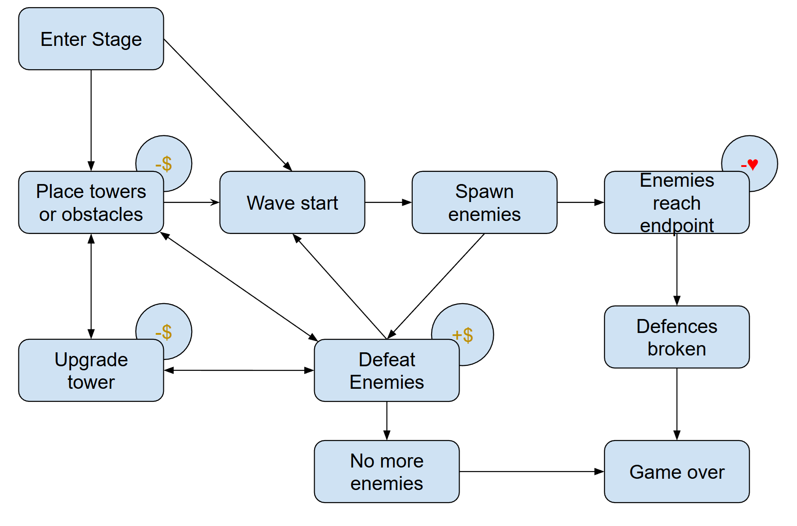
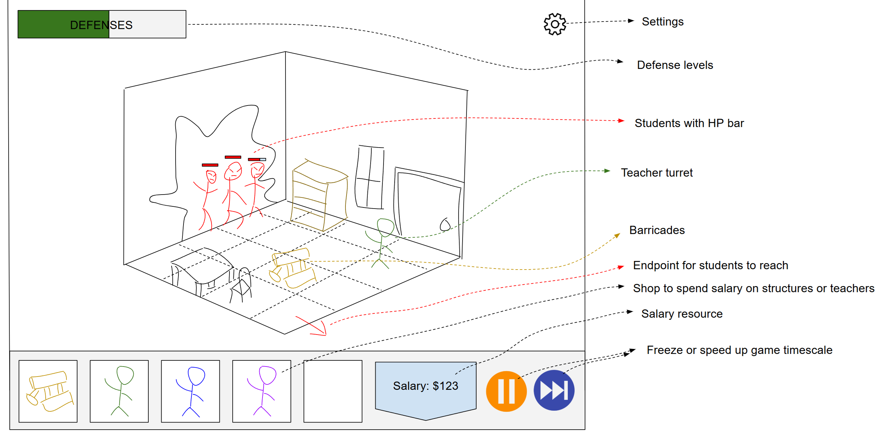
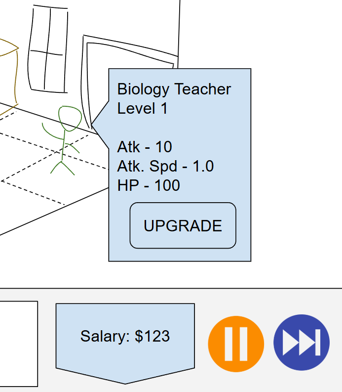

# project-rekt

A video game concept derived from a group project during my undergraduate years.

## High Level Vision

- Isometric grid based tower defense game set in a school environment where students are revolting en masse against the institute.
- Features placeable barriers and teacher "turrets" to fight against the student invasion over the school campus.
- Features Teamfight Tactics inspired grid movement and augments for added gameplay variance.
- Narrative is delivered through Danganronpa visual novel styled dialogue in-between stages and during stage gameplay when pinnacle scripted events occur.
- Main platforms are PC and mobile.
- Business model for this game will be a one time purchase to play forever.

## Art Style / Theme

- User Interface Style - Sidebar and/or action bar to deploy structures and access options or game speed.  

- Environments - Common school locations with classroom, library, courtyard and gym as an example.   

- Characters - Generally a students/teachers with standout traits. A code monkey would be able to jump over obstacles while a law teacher will wear down students with logical arguments.  

- Rendering Style - Cell shaded or stylized 3D environments and objects while characters will be 2D sprites.  

## Story

In response to the emergent student invasion, the university assembles the Faculty Defence Force AKA the F.D.F.  
Deploy teachers and obstacles to prevent the students from taking over the campus.  

## Core Loop

## Screens, UI, UX

- Defending a wave of students

- Tooltip when selecting students, teachers or structures  

## Game Economy

No premium currency, but may look into earned currency to spend on permanent upgrades or unlock new teachers and structures.

## Asset List

TBD

## Level Schema and Sample Level Design

TBD

## Team, Schedule, and Budget

TBD

## References

- [A Free Game Design Doc (GDD) Template](https://www.linkedin.com/pulse/free-game-design-doc-gdd-template-david-fox/?trackingId=p8bZP9EonjCr%2FD%2Bp%2FW4FkA%3D%3D)
