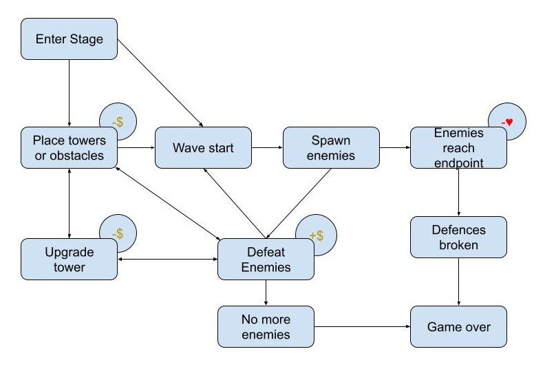

# project-rekt

A video game concept derived from a group project during my undergraduate years.

## High Level Vision

- Isometric grid based tower defense game set in a school environment where students are revolting en masse against the institute.
- Features placeable barriers and teacher "turrets" to fight against the student invasion over the school campus.
- Features Teamfight Tactics inspired grid movement and augments for added gameplay variance.
- Narrative is delivered through Danganronpa visual novel styled dialogue in-between stages and during stage gameplay when pinnacle scripted events occur.
- Main platforms are PC and mobile.
- Business model for this game will be a one time purchase to play forever.

## Art Style / Theme

- User Interface Style  

- Environments  

- Characters  

- Rendering Style  

## Story

In response to the emergent student invasion, the university assembles the Faculty Defence Force AKA the F.D.F.  
Deploy teachers and obstacles to prevent the students from taking over the campus.  

## Core Loop

## Screens, UI, UX

## Game Economy

## Asset List

## Level Schema and Sample Level Design

## Team, Schedule, and Budget

## References

- [A Free Game Design Doc (GDD) Template](https://www.linkedin.com/pulse/free-game-design-doc-gdd-template-david-fox/?trackingId=p8bZP9EonjCr%2FD%2Bp%2FW4FkA%3D%3D)
