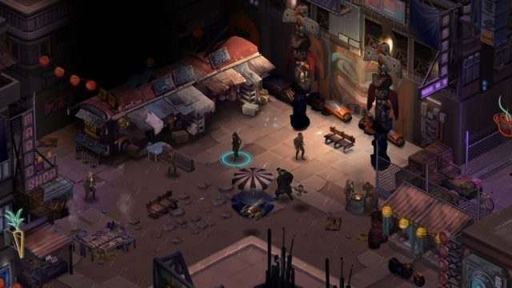
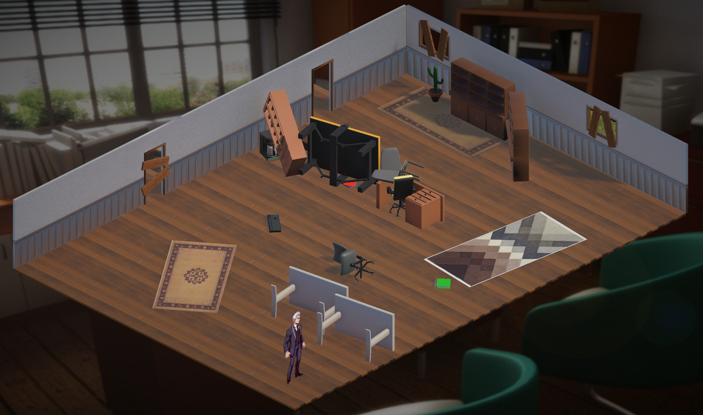

# project-rekt

A video game concept derived from a group project during my undergraduate years.

## High Level Vision

**A stylized tower-defense game where teachers defend the school from waves of revolting students.**

- Isometric grid based tower defense game set in a school environment where students are revolting en masse against the institute.
- Features placeable barriers and teacher "turrets" to fight against the student invasion over the school campus.
<!-- - Features Teamfight Tactics inspired grid movement and augments for added gameplay variance. -->
- Narrative is delivered through Danganronpa visual novel styled dialogue in-between stages and during stage gameplay when pinnacle scripted events occur.
- Core aesthetics for this game is sensation through sound, effects and the act of defeating waves of enemies.
- Main platform is PC.
- Business model for this game will be a one time purchase to play forever with optional cosmetic skins for teachers.

## Art Style / Theme

- User Interface Style - The information that must be shown are: defence levels, available currency, wave number, turret selection buttons, tooltips when selecting/hovering entities, game speed and game options.  
 

- Environments - Common school locations with classroom, library, courtyard and gym as an example.   

- Characters - Generally students/teachers with standout traits.
    - Students
        - Code Monkey - Computer Science student but can jump over obstacles.
        - Delinquent
        - Weeb
    - Star Students
        - These are unique exeptional students that perform beyond an average student. Typically reserved for each stage's final boss.  
        - Mutant Student - Final boss of stage 1. Can break through environments that are typically not expected to be destroyed, like walls and large permanent barricades. He traverses directly to the principal and generally one-shots all characters.
    - Teachers
        - Principal - The main defense target and leader of the FDF. Uses his fists to defend his school, the old fashioned way.
        - PE Teacher - Launches basketballs that bounce between targets.  
        - Law Teacher - Wear down students with logical arguments, dealing high single target damage.  
        - Biology Teacher - Rapidly grows plants that spits seeds at high speeds and fire rate.  
- Below is an example of 2D sprites and art theme.  

- Rendering Style - Isometric camera with a mix of 2d and 3d elements.
    - 2d sprite characters in 3d environments.  
    
    - 3d environments with isometric view.  
    

## Story

In response to the emergent student invasion, the university assembles the Faculty Defence Force AKA the F.D.F.  
Deploy teachers and obstacles to prevent the students from taking over the campus.  

## Core Loop

## Screens, UI, UX

- Defending a wave of students.  

- Tooltip when selecting students, teachers or structures  

## Level Schema and Sample Level Design

5 stages that start at the principal's office AKA the last line of defence. Successfully defend each location and retake the school in the following order:  
Principal's Office -> Library -> Gym -> Classroom -> Courtyard  

- Sample of Principal's Office

## Game Mechanics to Implement

- TFT augments to tweak teacher abilities and promote a playstyle.

## Game Economy

Each teacher will have at least 1 optional skin purchaseable for $2.99 delivered through DLC. It is something to add to monetisation but not interfere with core gameplay.

## Community Engagement

Actively engage with community members through official Discord server and Steam forums to collect feedback. The purpose is to gauge player sentiment and understand what needs to change.

<!-- ## Asset List

TBD -->

## Development Pipeline

1. Planning and Ideation - Writing up my ideas into a GDD and setting up Notion tasks for myself
2. Pre-Production - Designing my game with Unity and using Github for version control. In this stage, I intend to make or gather all the assets that I may use for my game.
3. Production - Create up to 5 game stages that I have in mind and implement the core game loop along with its narrative elements and post processing.
4. Testing and QA - Make sure that my game runs smoothly across different devices and collect early feedback on the feel of the game.
5. Post-Production - If all things go well, aim for a steam release and take advantage of NextFest to showcase my game to a wide audience. Prepare marketing material including game overview and launch trailer. Afterwards, continue to update and support the game according to player feedback.

## Risks

This game heavily depends on visual appeal and stylized characters. Reach out early to artists to collaborate.

## Integration of Feedback

- _Slow or awkward movment_  
Opted to use continuous movement instead of grid cell movement. It felt awkward that students are invading but they are stopping in place every second. Initially, I wanted to have more TFT inspired movement but it is now scrapped.

- _Player understanding and game clarity_ **TBD**  
Currently it is difficulty for the player to quickly understand the action of placing teachers. Players also have issues with clarity in areas where there are large number of entities in view. It can be difficult to differentiate teachers from students.

## Post-launch Content

If there is player demand for more content, consider looking into ways to add bonus stories through DLC. Additionally, free content updates like an endless mode can be considered.

## Team and Budget

Jeremy Ng:
- Producer
- Game Designer
- Quality Assurance Lead

<!-- TODO - CONSIDER FINDING DEDICATED ARTIST -->

Budget:
- [Unity Asset Store](https://assetstore.unity.com/) - $15
- AI Tools:
    - [AutoSprite](https://www.autosprite.io/) - $41

## Schedule

1. Planning and Ideation: `2026 JAN 1 to FEB 28`
2. Pre-Production: `2026 MAR 1 to APR 31`
3. Production: `2026 MAY 1 to JULY 30`
4. Testing and QA: `2026 AUG 1 to SEP 30`
5. Post-Production: `2026 OCT 1 to 2027 JAN 1`

## References

- [A Free Game Design Doc (GDD) Template](https://www.linkedin.com/pulse/free-game-design-doc-gdd-template-david-fox/?trackingId=p8bZP9EonjCr%2FD%2Bp%2FW4FkA%3D%3D)

## Credits
- Unity Asset Store
    - INab Studio
- Itch.io
    - styloo
    - Dillon Becker
- DeviantArt
    - LK-sixtyfour
- ArtStation
    - Caryl Chua
- AutoSprite.io
- MixKit.co
- Youtube
    - Sebastian Lague
    - Tarodev
- PixaBay
    - moodmode
    - Universfield
- SketchFab
    - FranoW
    - Shaina (Regan) Alvarez
    - Anom Purple Modelling
    - Bala mirnaalini