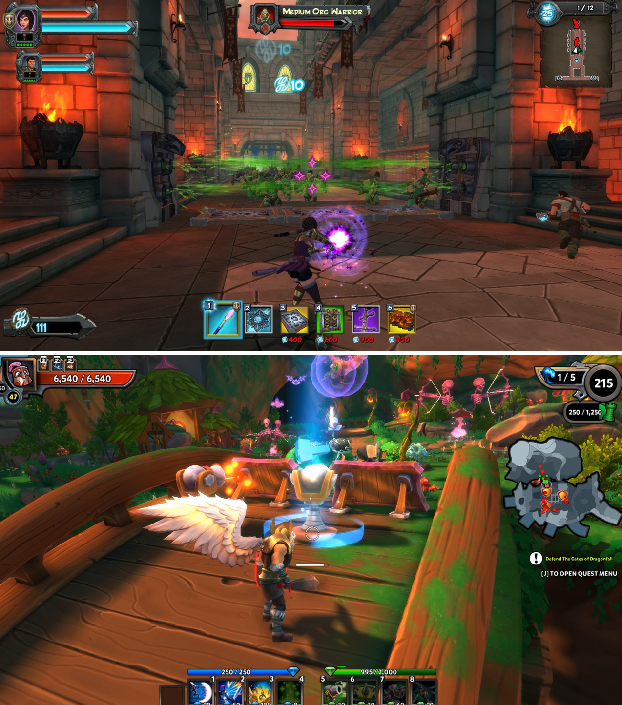
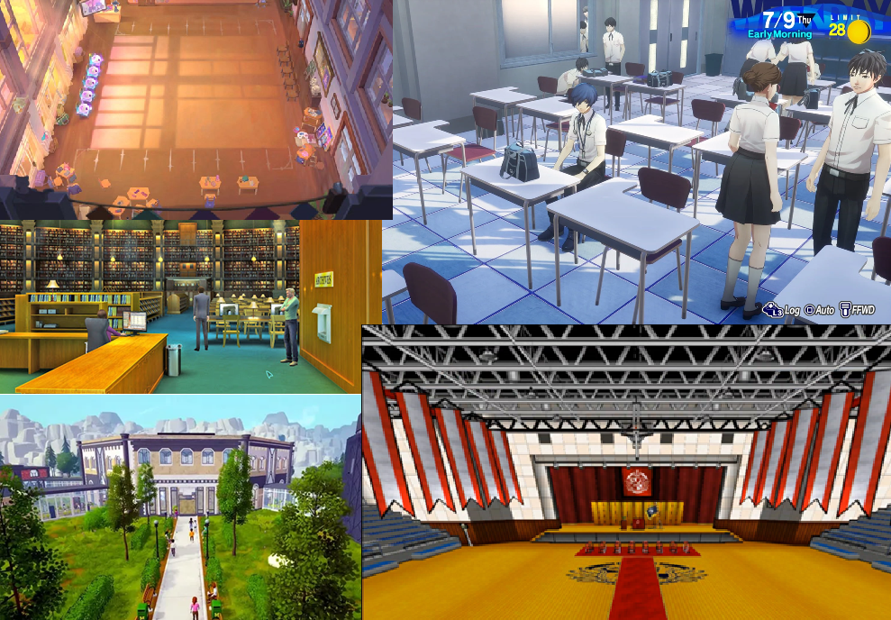
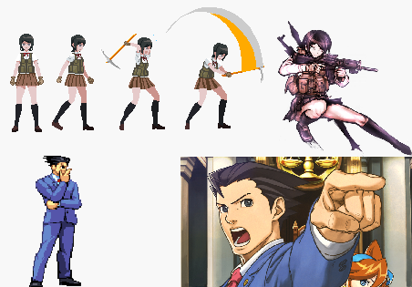
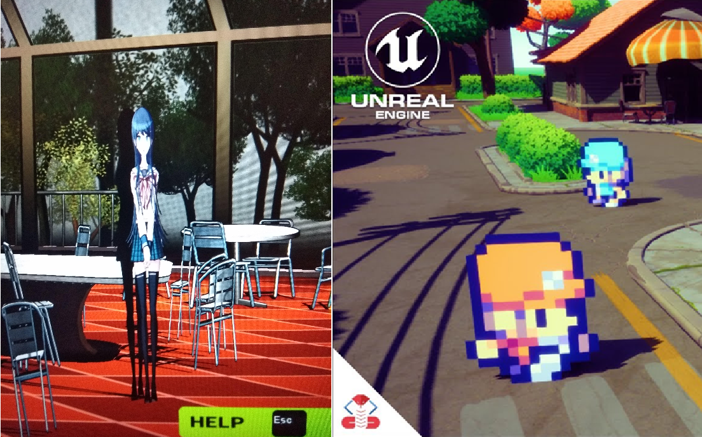
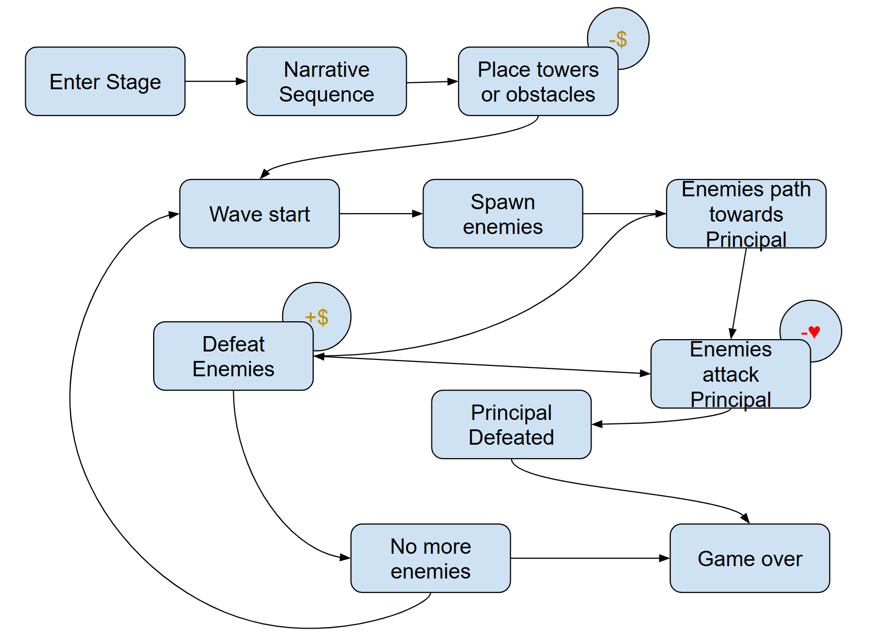
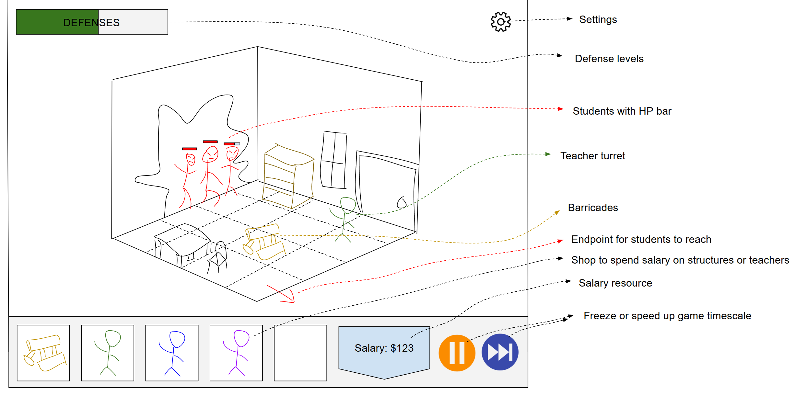
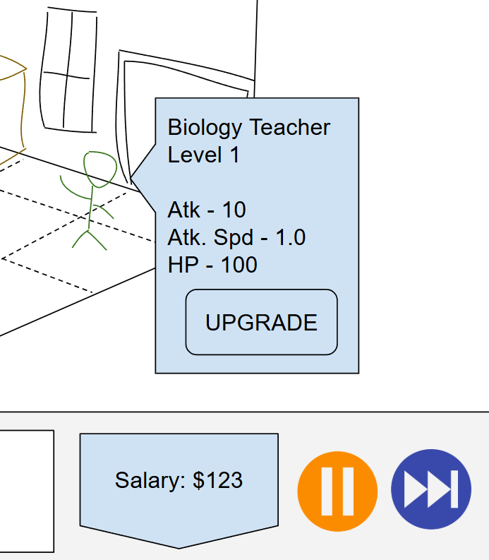
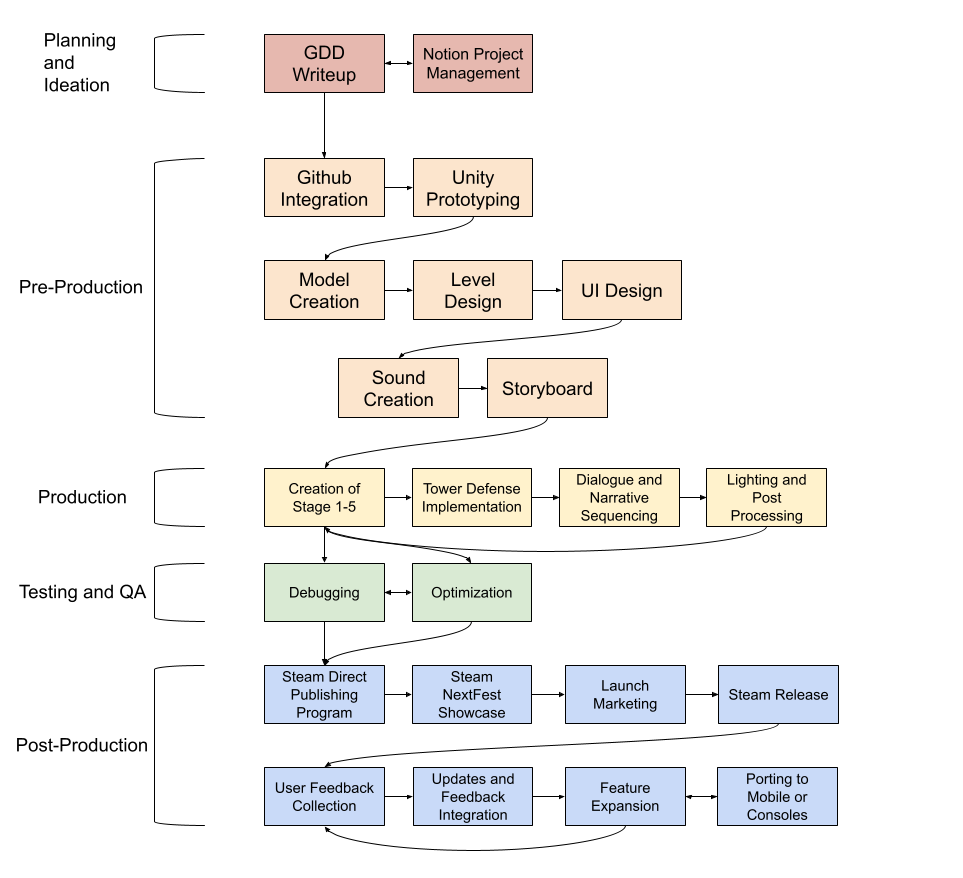

# project-rekt

A video game concept derived from a group project during my undergraduate years.

## High Level Vision

**A stylized tower-defense game where teachers defend the school from waves of revolting students.**

- Isometric grid based tower defense game set in a school environment where students are revolting en masse against the institute.
- Features placeable barriers and teacher "turrets" to fight against the student invasion over the school campus.
- Features Teamfight Tactics inspired grid movement and augments for added gameplay variance.
- Narrative is delivered through Danganronpa visual novel styled dialogue in-between stages and during stage gameplay when pinnacle scripted events occur.
- Core aesthetics for this game is sensation through sound, effects and the act of slowing/defeating waves of students.
- Main platforms are PC.
- Business model for this game will be a one time purchase to play forever with optional cosmetic skins for teachers.

## Art Style / Theme

- User Interface Style - Through the UI, the information that must be shown are: defence levels, available currency, wave number, turret selection buttons, tooltips when selecting/hovering entities, game speed and game options.  

- Environments - Common school locations with classroom, library, courtyard and gym as an example.   

- Characters - Generally students/teachers with standout traits.
    - Students
        - Code Monkey - Computer Science student but can jump over obstacles.
    - Teachers
        - PE Teacher - Launches basketballs that bounce between targets.  
        - Law Teacher - Wear down students with logical arguments, dealing high single target damage.  
        - Biology Teacher - Rapidly grows plants that spits seeds at high speeds and fire rate.  
- Below is an example of 2D sprites and art theme.  

- Rendering Style - Cell shaded or stylized 3D environments and objects while characters will be 2D sprites.  
<!-- __TODO BE MORE SPECIFIC. REFERENCES ARE CONFUSING. THINK ABOUT WHICH ONE IS A BETTER CHOICE FOR MY GAME. THINK ABOUT HIGH FANTASY ELEMENTS IN THE DESIGN__   -->

## Story

In response to the emergent student invasion, the university assembles the Faculty Defence Force AKA the F.D.F.  
Deploy teachers and obstacles to prevent the students from taking over the campus.  

## Core Loop

## Screens, UI, UX

- Defending a wave of students.  
<!-- - __TODO MAJOR CONSIDERATION IS CAMERA__   -->

- Tooltip when selecting students, teachers or structures  

## Game Economy

Each teacher will have at least 1 optional skin purchaseable for $2.99 delivered through DLC. It is something to add to monetisation but not interfere with core gameplay.

## Asset List

TBD

## Level Schema and Sample Level Design

5 stages that start at the principal's office AKA the last line of defence. Successfully defend each location and retake the school in the following order:  
Principal's Office -> Library -> Gym -> Classroom -> Courtyard  

SAMPLE TBD

## Development Pipeline

1. Planning and Ideation - Writing up my ideas into a GDD and setting up Notion tasks for myself
2. Pre-Production - Designing my game with Unity and using Github for version control. In this stage, I intend to make or gather all the assets that I may use for my game.
3. Production - Create up to 5 game stages that I have in mind and implement the core game loop along with its narrative elements and post processing.
4. Testing and QA - Make sure that my game runs smoothly across different devices and collect early feedback on the feel of the game.
5. Post-Production - If all things go well, aim for a steam release and take advantage of NextFest to showcase my game to a wide audience. Prepare marketing material including game overview and launch trailer. Afterwards, continue to update and support the game according to player feedback.

## Risks

This game heavily depends on visual appeal and stylized characters. Reach out early to artists to collaborate.

## Team and Budget

Jeremy Ng:
- Producer
- Game Designer
- Quality Assurance Lead

<!-- TODO - CONSIDER FINDING DEDICATED ARTIST -->

Budget:
- [Unity Asset Store](https://assetstore.unity.com/) - $15
- AI Tools:
    - [AutoSprite](https://www.autosprite.io/) - $41

## Schedule

1. Planning and Ideation: `2026 JAN 1 to FEB 1`
2. Pre-Production: `2026 FEB 1 to MAR 15`
3. Production: `2026 MAR 16 to APR 15`
4. Testing and QA: `2026 APR 16 to MAY 31`
5. Post-Production: `2026 JUN 1 to 2027 JAN 1`

## References

- [A Free Game Design Doc (GDD) Template](https://www.linkedin.com/pulse/free-game-design-doc-gdd-template-david-fox/?trackingId=p8bZP9EonjCr%2FD%2Bp%2FW4FkA%3D%3D)

## Credits
- Unity Asset Store
    - INab Studio
- Itch.io
    - styloo
    - Dillon Becker
- DeviantArt
    - LK-sixtyfour
- ArtStation
    - Caryl Chua
- AutoSprite.io
- MixKit.co
- Youtube
    - Sebastian Lague
